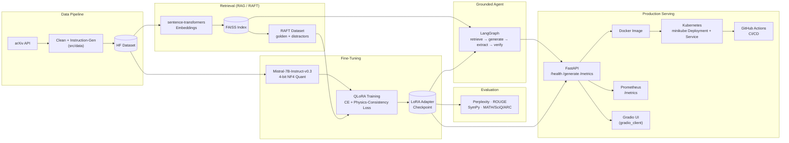

# scientific-llm

**QLoRA fine-tuning of Mistral-7B-Instruct-v0.3 on arXiv physics & math papers** — with a physics-consistency training signal, a SymPy-based mathematical verification layer, a RAG/RAFT-grounded retrieval agent, and a full production-serving stack (FastAPI, Docker, Kubernetes, Prometheus, Gradio). Built and verified one component at a time, on a single 8GB consumer GPU.


Full mathematical derivations for LoRA/QLoRA (including a numeric autograd proof) live in [`notebooks/lora_math.ipynb`](notebooks/lora_math.ipynb).

---

## Architecture



---

## Key Equations

**Low-Rank Adaptation (LoRA).** For a frozen pretrained weight matrix $W_0 \in \mathbb{R}^{d \times k}$, LoRA learns a low-rank update instead of fine-tuning $W_0$ directly:

$$W' = W_0 + \Delta W = W_0 + \frac{\alpha}{r}BA$$

where $B \in \mathbb{R}^{d \times r}$, $A \in \mathbb{R}^{r \times k}$, and $r \ll \min(d, k)$. This project uses $r = 16$, $\alpha = 32$ across all 7 linear projections per transformer layer — **1.10% of parameters trainable** (`src/model/lora_config.py`).

**4-bit NF4 Quantization (QLoRA).** The frozen base weights are stored in 4-bit NormalFloat with double quantization and dequantized on the fly for each forward pass:

$$W_0 \approx \mathrm{dequant}_{\mathrm{NF4}}\big(W_0^{\,4\text{-bit}},\, c_1,\, c_2\big)$$

keeping peak VRAM at **4.80GB** for a 7B-parameter model on an 8GB card (`src/model/base_model.py`).

**Physics-Consistency Margin Loss.** Given a correct equation completion and a deliberately corrupted one (sign flip, exponent flip, or a derivative-subscript swap), the model's sequence log-probability of each is compared and penalized with a hinge margin:

$$\mathcal{L}_{\text{phys}} = \max\!\Big(0,\; m - \big(\log P_\theta(y_{\text{correct}}) - \log P_\theta(y_{\text{corrupt}})\big)\Big)$$

combined with ordinary cross-entropy during training (`src/model/physics_loss.py`, `src/training/trainer.py`):

$$\mathcal{L}_{\text{total}} = \mathcal{L}_{\text{CE}} + \lambda\,\mathcal{L}_{\text{phys}}, \qquad \lambda = 0.1$$

**Perplexity.** The standard held-out evaluation metric, averaged in log-space before exponentiating — not the other way around, which would overweight a model's single worst example:

$$\mathrm{PPL} = \exp\!\left(\frac{1}{N}\sum_{i=1}^{N} -\log P_\theta(x_i \mid x_{<i})\right)$$

(`src/evaluation/perplexity.py`)

---

## Build Status

- [x] **Environment setup** — Windows 11, Python 3.13, venv, CUDA-enabled PyTorch, bitsandbytes, Hugging Face stack — verified on an RTX 4060 8GB
- [x] **Base model + LoRA** — 4-bit NF4 quantized Mistral-7B, LoRA adapters attached, math derivation notebook — 4.80GB peak VRAM, 1.10% trainable parameters
- [x] **arXiv data pipeline** — fetch, clean, instruction-pair generation, HuggingFace dataset construction
- [x] **QLoRA training loop + physics-consistency loss** — hand-written PyTorch training loop with combined CE + physics-margin loss
- [x] **Evaluation suite** — perplexity, from-scratch ROUGE-1/2/L, SymPy symbolic math verification, MATH/SciQ/ARC-Challenge benchmark subsets
- [x] **RAG retrieval + RAFT dataset construction** — FAISS vector index, sentence-transformers embeddings, golden+distractor training examples
- [x] **Retrieval-grounded agent** — 4-node LangGraph pipeline (retrieve → generate → extract → verify) with a conditional retry edge
- **Production deployment** (each sub-component independently verified):
  - [x] FastAPI serving layer (`/health`, `/generate`)
  - [x] Docker (GPU-passthrough container, minimal image)
  - [x] Kubernetes / minikube (Deployment + Service, CPU-only degraded mode by design — see note below)
  - [x] Prometheus metrics (`/metrics`, 5 custom metric families)
  - [ ] Gradio UI
  - [ ] GitHub Actions CI/CD

---

## Hardware & Base Model

- **Hardware:** NVIDIA RTX 4060, 8GB VRAM, CUDA 12.9 driver. Every design choice (batch size, sequence length, gradient checkpointing, model selection) is tuned against this 8GB budget.
- **Base model:** [`mistralai/Mistral-7B-Instruct-v0.3`](https://huggingface.co/mistralai/Mistral-7B-Instruct-v0.3) — a gated Hugging Face repo requiring a free, near-instant access request and a read-scope access token (`hf auth login`).

---

## Component Walkthrough

### 1. Environment Setup
`scripts/verify_environment.py` checks Python version, every package import + version, CUDA availability and GPU name/VRAM, and runs a real functional test that quantizes a layer with bitsandbytes and performs a GPU forward pass — not just an import check.

### 2. Base Model + LoRA
- `src/model/base_model.py` — loads Mistral-7B-Instruct-v0.3 with 4-bit NF4 + double quantization, runs a generation smoke test.
- `src/model/lora_config.py` — attaches LoRA adapters ($r=16$, $\alpha=32$, all 7 linear projections per layer), counts trainable parameters, verifies gradients land only on LoRA weights via a forward+backward smoke test.
- `notebooks/lora_math.ipynb` — full derivation of why low-rank updates work, parameter-count math verified against Mistral-7B's actual config, a numeric proof that the gradient formulas match PyTorch autograd, and the NF4/double-quantization memory math.

### 3. arXiv Data Pipeline
- `arxiv_loader.py` — queries the live arXiv API directly (standard library `urllib` + XML parsing, no extra dependency), respecting arXiv's usage policy (≥3s delay between requests).
- `preprocessor.py` — cleans abstract whitespace, extracts LaTeX equations (`$...$`, `$$...$$`, `\(...\)`, `\[...\]`), filters overly short abstracts.
- `instruction_gen.py` — converts cleaned papers into `{instruction, input, output}` triples. Two templates use the paper's real abstract text as genuine supervised output; the equation-explanation template deliberately anchors to the abstract's most relevant sentence rather than fabricating an explanation.
- `dataset.py` — builds a HuggingFace `DatasetDict` (train/validation split) with an Alpaca-style formatted `text` field.

The real, full-scale collection run targets a 50,000–100,000 paper corpus (25–40+ minutes, run politely against arXiv's rate limit); the standard verification run uses a small sample to confirm the pipeline works end to end.

> ⚠️ **Known issue:** the repository's `.gitignore` uses a bare `data/` pattern, which unintentionally matches `src/data/` as well as the intended top-level `data/` artifacts folder — so this component's source files are currently excluded from version control despite being referenced by `scripts/verify_step3.py`. Fix: scope the ignore rule to `/data/` (or `/outputs/`, `/data/` explicitly at repo root) and re-commit `src/data/`.

### 4. QLoRA Training Loop + Physics-Consistency Loss
- `src/model/physics_loss.py` — extends PINN-style physics constraints to LLM fine-tuning. Since an LLM's output is discrete tokens (no PDE residual to differentiate), this instead builds an equation-preference margin loss: given a real equation and a deliberately corrupted version (sign flip, exponent flip, or derivative-subscript swap), it computes the model's sequence log-probability of each completion and penalizes the model for not preferring the correct one by at least a margin. This is one additional training-time signal alongside cross-entropy — not a guarantee of physical correctness; the separate SymPy layer (below) checks actual correctness post-generation.
- `src/training/trainer.py` — a hand-written PyTorch training loop (deliberately not TRL's `SFTTrainer` or the HuggingFace `Trainer`, to keep the forward pass, loss combination, and gradient accumulation fully visible and verifiable). Microbatch size of 1 with gradient accumulation for a larger effective batch size, matching the 8GB VRAM budget. Saves the LoRA adapter via `peft_model.save_pretrained()`.
- `src/training/merge.py` — merges a trained LoRA adapter into the base model ($W' = W + \frac{\alpha}{r}BA$), producing a single dense model with no `peft` dependency needed to load it. Runs on CPU by design: merging requires the base model in fp16 (too large for the 8GB card), but the operation itself is memory-bound rather than compute-bound.

### 5. Evaluation Suite
- `src/evaluation/perplexity.py` — standard held-out perplexity, computed on either the base model or a fine-tuned checkpoint.
- `src/evaluation/rouge_eval.py` — ROUGE-1/2/L implemented from scratch (n-gram overlap for ROUGE-1/2, longest-common-subsequence for ROUGE-L).
- `src/evaluation/math_verifier.py` — a SymPy-based symbolic equivalence checker (not a training signal — a post-hoc verifier). Independently confirms, using real algebra rather than the regex that produced it, that the corruption logic in Step 4 actually changes an equation's meaning. Scoped honestly: it compares same-notation algebra, not physical laws across notations, and treats derivative subscripts and operators as opaque symbols.
- `src/evaluation/benchmarks.py` — evaluates against small subsets of SciQ, ARC-Challenge, and MATH (`HuggingFaceH4/MATH-500`), scoring multiple-choice by extracted letter and MATH problems by SymPy equivalence rather than exact string match. Falls back to small built-in examples if a dataset can't be downloaded, and reports explicitly when it did so a fallback is never silently mistaken for a real benchmark number.

### 6. RAG Retrieval + RAFT Dataset Construction
- `src/rag/embeddings.py` — `sentence-transformers/all-MiniLM-L6-v2` (384-dim, ~80MB), runs on CPU by design so the full 8GB of VRAM stays free for the LLM.
- `src/rag/vector_store.py` — a `VectorStore` wrapping a flat FAISS index (brute-force inner product; the corpus is small enough that an approximate index buys nothing) plus parallel metadata, with save/load.
- `src/rag/retriever.py` — builds an index from paper abstracts and retrieves against a query, with an `exclude_paper_id` option that fetches k+1 and drops one so excluding a hit never starves the result count.
- `src/rag/raft.py` — RAFT dataset construction: each training example mixes the real source document (the "golden" document) with retrieved near-miss distractors, shuffled and labeled, with the target output naming which document the answer came from — training the model to locate the right source among plausible noise rather than parroting whatever's in context.

### 7. Retrieval-Grounded Agent (LangGraph)
`src/agent/graph.py` — a four-node LangGraph agent: retrieve → generate (answering from retrieved context only) → extract (LaTeX equations from the model's own output) → verify (SymPy check of whether any stated equation actually appears, algebraically, in the retrieved sources). A conditional edge routes back to generation with a stricter prompt on verification failure, up to a configurable `max_attempts` — the actual reason this uses LangGraph rather than a plain function chain. Scoped honestly: "grounded" means the equation appears in a retrieved source, not that it is physically true, and only equations delimited with `$...$` can be checked at all.

### 8. Production Deployment

**FastAPI serving layer** (`src/api/main.py`, `src/api/schemas.py`) — `create_app(generate_fn, ...)` builds the app around an already-resolved generate function (fully testable with `TestClient` and no GPU needed); `create_production_app()` loads the base model and auto-detects a trained LoRA checkpoint via `PeftModel.from_pretrained()` (not `attach_lora()`, which would build fresh randomly-initialized adapters and silently discard training). If no checkpoint or GPU is found, the API serves in a degraded state (`/health` returns 200 with `status: "degraded"`, `/generate` returns a clean 503) rather than crashing.

**Docker** (`Dockerfile`) — `python:3.11-slim` base rather than an `nvidia/cuda` image (torch and bitsandbytes bundle their own CUDA runtime; only the host needs the driver). Only `src/api/` and `src/model/` are copied in. The Hugging Face cache and any trained checkpoint are mounted as volumes at run time, not baked into the image.

**Kubernetes / minikube** (`k8s/deployment.yaml`, `k8s/service.yaml`) — deploys the same image Docker built, verified through a real Kubernetes Service. Runs deliberately without GPU passthrough (minikube's `docker` driver doesn't support NVIDIA GPU passthrough on Windows), so the pod runs in the same degraded-but-serving state the API already handles by design — this step verifies the Kubernetes control plane (Deployment, Service, rollout, health probes) on top of an image already proven to work with a real GPU via Docker. `imagePullPolicy: Never` since the image is built directly into minikube's internal Docker daemon, never pushed to a registry.

**Prometheus metrics** — `GET /metrics` in Prometheus text exposition format, five metrics under a `scientific_llm_` prefix: a request Counter (labeled by endpoint/method/status code, including validation failures and degraded-mode 503s), a request-duration Histogram, and three Gauges (`model_loaded`, `adapter_loaded`, `gpu_available`) mirroring `/health`'s own flags. Metrics are registered against a dedicated `CollectorRegistry` per app instance rather than `prometheus_client`'s global default registry, since `create_app()` is called multiple times across the test suite and duplicate registration against the global registry raises a hard error.

**Gradio UI** (`src/ui/gradio_app.py`) — a browser UI that is a pure HTTP client of the FastAPI backend; it does not load the model itself. `build_interface(generate_fn, health_fn)` takes plain callables (fully unit-testable, no networking, no GPU); `create_production_interface()` supplies the real HTTP-calling versions via an `API_BASE_URL` environment variable. This split means the UI can run as its own lightweight pod with no GPU request, pointed at the API by its in-cluster DNS name.

---

## Tech Stack

| Category | Tools & Libraries |
| --- | --- |
| **Language** | Python 3.11 / 3.13, PowerShell, YAML |
| **Deep Learning** | PyTorch (CUDA 12.9), Hugging Face `transformers`, `accelerate` |
| **Efficient Fine-Tuning** | `peft` (LoRA), `bitsandbytes` (4-bit NF4 QLoRA + double quantization), `sentencepiece` |
| **Data Engineering** | Hugging Face `datasets`, arXiv API (`urllib` + XML), custom cleaning/instruction-generation pipeline |
| **Scientific Verification** | SymPy (symbolic equation equivalence checking) |
| **Retrieval / RAG** | FAISS (`faiss-cpu`), `sentence-transformers` (`all-MiniLM-L6-v2`) |
| **Agentic Orchestration** | LangGraph, LangChain Core |
| **Model Serving** | FastAPI, Uvicorn, Pydantic |
| **Web UI** | Gradio, `gradio_client` |
| **Observability** | `prometheus_client` (Counters, Histograms, Gauges) |
| **Containerization** | Docker, Docker Desktop (WSL2 backend) |
| **Orchestration** | Kubernetes, minikube, kubectl |
| **CI/CD** | GitHub Actions *(planned)* |
| **Testing / Verification** | Custom real-HTTP + real-subprocess verification harnesses per component, FastAPI `TestClient`, `gradio_client` |
| **Dev Environment** | Jupyter / `ipykernel`, Python `venv` |
| **Hardware** | NVIDIA RTX 4060, 8GB VRAM, CUDA 12.9 driver |

---

## Project Structure

```
scientific-llm/
├── src/
│   ├── data/            # arXiv fetch, clean, instruction-gen, HF dataset (see Known Issue above)
│   ├── model/            # Base model loading (4-bit NF4), LoRA config, physics-consistency loss
│   ├── training/           # Training loop, callbacks/logging, adapter merging
│   ├── evaluation/          # Perplexity, ROUGE, SymPy math verifier, MATH/SciQ/ARC benchmarks
│   ├── rag/                  # Embeddings, FAISS vector store, retriever, RAFT dataset construction
│   ├── agent/                  # LangGraph retrieval-grounded agent
│   ├── api/                     # FastAPI serving layer (health, generate, metrics)
│   └── ui/                       # Gradio web UI (HTTP client of the API)
├── notebooks/
│   └── lora_math.ipynb          # Full LoRA/QLoRA mathematical derivation
├── scripts/                      # Per-component verification harnesses
├── k8s/                            # Kubernetes Deployment + Service manifests
├── Dockerfile
├── requirements-step*.txt          # Incremental, per-component dependency sets
└── requirements-docker.txt          # Minimal serving-image dependencies
```

---

## Getting Started

```powershell
# 1. Environment setup (Python 3.13, CUDA PyTorch, bitsandbytes, HF stack)
Set-ExecutionPolicy -Scope Process -ExecutionPolicy Bypass
.\setup_step1.ps1

# 2. One-time Hugging Face access for the gated Mistral-7B repo
hf auth login

# 3. Load base model + attach LoRA
.\setup_step2.ps1

# 4. Build the arXiv training corpus (small sample by default)
.\setup_step3.ps1
# Full-scale run:
python src\data\arxiv_loader.py --max-results 50000
python src\data\preprocessor.py
python src\data\instruction_gen.py
python src\data\dataset.py

# 5. QLoRA training with physics-consistency loss
.\setup_step4.ps1

# 6. Evaluation suite
.\setup_step5.ps1

# 7. RAG index + RAFT dataset
.\setup_step6.ps1

# 8. Retrieval-grounded agent
.\setup_step7.ps1

# 9. Production serving
.\setup_step8a.ps1   # FastAPI
.\setup_step8b.ps1   # Docker (GPU passthrough)
.\setup_step8c.ps1   # Kubernetes / minikube
.\setup_step8d.ps1   # Prometheus metrics
.\setup_step8e.ps1   # Gradio UI
```

Try the API directly once Step 8a passes:

```powershell
uvicorn src.api.main:app --host 0.0.0.0 --port 8000
```
```powershell
curl.exe http://127.0.0.1:8000/health
curl.exe -X POST http://127.0.0.1:8000/generate -H "Content-Type: application/json" -d '{"prompt": "What is E=mc^2?", "max_new_tokens": 100}'
```

### Environment notes

- **Windows venvs cannot be moved.** Absolute paths get embedded in `venv\Scripts\pip.exe` and other launchers at creation time; if the project folder moves, delete `venv` and re-run `setup_step1.ps1` in the new location.
- **Hugging Face's current CLI is `hf`**, not the deprecated `huggingface-cli` — use `hf auth login` / `hf auth whoami`.
- **Set `HF_HOME`** to a drive with enough free space for model weights (~14–15GB for Mistral-7B) via `setx HF_HOME <path>` so it persists across terminal sessions.
