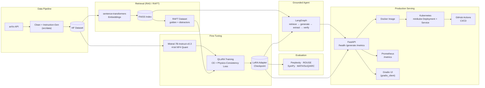

# scientific-llm

**QLoRA fine-tuning of Mistral-7B-Instruct-v0.3 on arXiv physics & math
papers** — with a physics-consistency training signal, a SymPy-based
mathematical verification layer, a RAG/RAFT-grounded retrieval agent, and a
full production-serving stack (FastAPI, Docker, Kubernetes, Prometheus,
Gradio). Built and verified one component at a time, on a single 8GB
consumer GPU.


Full spec and roadmap tracked component by component; this README grows
with each step (mathematical derivations for LoRA/QLoRA land in
`notebooks/lora_math.ipynb`).

## Architecture



## Tech Stack

| Category | Tools & Libraries |
| --- | --- |
| **Language** | Python 3.11 / 3.13, PowerShell, YAML |
| **Deep Learning** | PyTorch (CUDA 12.9), Hugging Face `transformers`, `accelerate` |
| **Efficient Fine-Tuning** | `peft` (LoRA), `bitsandbytes` (4-bit NF4 QLoRA + double quantization), `sentencepiece` |
| **Data Engineering** | Hugging Face `datasets`, arXiv API (`urllib` + XML), custom cleaning/instruction-generation pipeline |
| **Scientific Verification** | SymPy (symbolic equation equivalence checking) |
| **Retrieval / RAG** | FAISS (`faiss-cpu`), `sentence-transformers` (`all-MiniLM-L6-v2`) |
| **Agentic Orchestration** | LangGraph, LangChain Core |
| **Model Serving** | FastAPI, Uvicorn, Pydantic |
| **Web UI** | Gradio, `gradio_client` |
| **Observability** | `prometheus_client` (Counters, Histograms, Gauges) |
| **Containerization** | Docker, Docker Desktop (WSL2 backend) |
| **Orchestration** | Kubernetes, minikube, kubectl |
| **CI/CD** | GitHub Actions *(Step 8f)* |
| **Testing / Verification** | Custom real-HTTP + real-subprocess verification harnesses per step, FastAPI `TestClient`, `gradio_client` |
| **Dev Environment** | Jupyter / `ipykernel`, Python `venv` |
| **Hardware** | NVIDIA RTX 4060, 8GB VRAM, CUDA 12.9 driver |

## Key Equations

Full derivations (including a numeric autograd proof) live in
`notebooks/lora_math.ipynb`; these are the ones that shape the code most
directly.

**Low-Rank Adaptation (LoRA).** For a frozen pretrained weight matrix
$W_0 \in \mathbb{R}^{d \times k}$, LoRA learns a low-rank update instead of
fine-tuning $W_0$ directly:

$$W' = W_0 + \Delta W = W_0 + \frac{\alpha}{r}BA$$

where $B \in \mathbb{R}^{d \times r}$, $A \in \mathbb{R}^{r \times k}$, and
$r \ll \min(d, k)$. This project uses $r = 16$, $\alpha = 32$ across all 7
linear projections per transformer layer — **1.10% of parameters
trainable** (`src/model/lora_config.py`).

**4-bit NF4 Quantization (QLoRA).** The frozen base weights are stored in
4-bit NormalFloat with double quantization and dequantized on the fly for
each forward pass:

$$W_0 \approx \mathrm{dequant}_{\mathrm{NF4}}\big(W_0^{\,4\text{-bit}},\, c_1,\, c_2\big)$$

keeping peak VRAM at **4.80GB** for a 7B-parameter model on an 8GB card
(`src/model/base_model.py`).

**Physics-Consistency Margin Loss.** Given a correct equation completion
and a deliberately corrupted one (sign flip, exponent flip, or a
derivative-subscript swap), the model's sequence log-probability of each
is compared and penalized with a hinge margin:

$$\mathcal{L}_{\text{phys}} = \max\!\Big(0,\; m - \big(\log P_\theta(y_{\text{correct}}) - \log P_\theta(y_{\text{corrupt}})\big)\Big)$$

combined with ordinary cross-entropy during training (`src/model/physics_loss.py`, `src/training/trainer.py`):

$$\mathcal{L}_{\text{total}} = \mathcal{L}_{\text{CE}} + \lambda\,\mathcal{L}_{\text{phys}}, \qquad \lambda = 0.1$$

**Perplexity.** The standard held-out evaluation metric, averaged in
log-space before exponentiating — not the other way around, which would
overweight a model's single worst example:

$$\mathrm{PPL} = \exp\!\left(\frac{1}{N}\sum_{i=1}^{N} -\log P_\theta(x_i \mid x_{<i})\right)$$

(`src/evaluation/perplexity.py`)

## Status

- [x] Step 1 — Environment setup (Windows 11, Python 3.13, venv, PyTorch +
      CUDA, bitsandbytes, HF stack) — verified on an RTX 4060 8GB
- [x] Step 2 — Load & 4-bit quantize the base model, attach LoRA adapters,
      LoRA/QLoRA math derivation notebook — verified: 4.80GB peak VRAM,
      1.10% trainable parameters, correct generation output
- [x] Step 3 — arXiv data collection pipeline (fetch, clean, instruction
      pairs, HuggingFace dataset)
- [x] Step 4 — QLoRA training loop + physics-consistency loss — verified:
      all checks passed on your RTX 4060
- [x] Step 5 — Evaluation suite (perplexity, ROUGE, SymPy math
      verification, MATH/SciQ/ARC-Challenge benchmarks) — verified: all
      checks passed on your RTX 4060
- [x] Step 6 — RAG retrieval + RAFT dataset construction (FAISS,
      sentence-transformers) — verified: all checks passed on your
      RTX 4060
- [x] Step 7 — Retrieval-grounded agent (LangGraph) — verified: all
      checks passed on your RTX 4060
- [ ] Step 8 — Production deployment (split into sub-steps - each has
      genuinely different tooling and its own verification, matching
      the project's "test before moving on" approach)
  - [x] Step 8a — FastAPI serving layer — verified: all checks passed
        on your RTX 4060
  - [x] Step 8b — Docker — confirmed passing after working through a
        Windows disk-space/Docker Desktop issue on your machine
  - [x] Step 8c — Kubernetes (minikube) — verified: 4/4 checks passed on
        a real minikube cluster (CPU-only - degraded mode, as expected
        without GPU passthrough on Windows, see its own README section)
  - [x] Step 8d — Prometheus metrics — verified: 10/10 checks passed on
        your RTX 4060, including real request counts/latency/gauges
        read back from a live /metrics endpoint
  - [ ] Step 8e — Gradio UI
  - [ ] Step 8f — GitHub Actions CI/CD
- [ ] ...

## Hardware assumption

Confirmed hardware for this setup: **NVIDIA RTX 4060, 8GB VRAM**, driver
CUDA 12.9. Every later step (batch size, sequence length, gradient
checkpointing, model choice) is tuned against that 8GB budget.

## Base model

`mistralai/Mistral-7B-Instruct-v0.3` — a gated Hugging Face repo (instant
approval). See Step 2 below for the one-time login steps.

## Environment notes specific to this machine

Worth knowing before re-running anything from scratch:

- **The venv cannot be moved.** Windows venvs embed absolute paths in
  `venv\Scripts\pip.exe` and other installed command launchers at creation
  time. If this whole folder is ever moved again, delete `venv` and
  re-run `setup_step1.ps1` in the new location rather than trying to move
  the old one — moving it breaks `pip`, `hf`, `jupyter`, etc. even though
  `python.exe` itself keeps working (which makes the breakage confusing).
- **Hugging Face's CLI is `hf`, not `huggingface-cli`** on the version
  installed here (`huggingface-cli` is deprecated and just warns). Use
  `hf auth login` / `hf auth whoami`.
- **The Hugging Face cache lives on `F:`, not `C:`.** `C:` has almost no
  free space, so `HF_HOME` is set to `F:\huggingface-cache` (via `setx`,
  so it persists across terminal sessions). If a fresh terminal ever
  shows Hugging Face re-downloading things or asking to log in again,
  check `$env:HF_HOME` is still `F:\huggingface-cache`.

## Step 1 — Environment setup

Files:

- `setup_step1.ps1` — PowerShell script: creates the venv, installs
  CUDA-enabled PyTorch, installs the rest of the Step 1 stack, then runs
  the verifier.
- `requirements-step1.txt` — pinned-loosely dependency list for Step 1
  (deliberately does **not** include torch — see the comment at the top of
  that file for why).
- `scripts/verify_environment.py` — standalone check: Python version, venv,
  every package import + version, CUDA availability + GPU name/VRAM, and a
  real functional test that quantizes a layer with bitsandbytes and runs a
  forward pass on the GPU (not just "did it import").

### How to run it

1. Create a project folder, e.g. `C:\Users\<you>\Projects\scientific-llm`,
   and put these three files/folders in it (`setup_step1.ps1`,
   `requirements-step1.txt`, `scripts\verify_environment.py`).
2. Open PowerShell in that folder.
3. Allow the script to run for this session:
   ```powershell
   Set-ExecutionPolicy -Scope Process -ExecutionPolicy Bypass
   ```
4. Run it:
   ```powershell
   .\setup_step1.ps1
   ```
5. Paste the full output back — especially the verifier's PASS/FAIL summary
   at the end — so we can confirm before moving to Step 2.

The script stops at the first failure with an explanation of what to do
next, rather than continuing on top of a broken environment.

## Step 2 — Base model + LoRA

Files:

- `src/model/base_model.py` — loads Mistral-7B-Instruct-v0.3 with 4-bit
  NF4 + double quantization (bitsandbytes), runs a generation smoke test.
  Runnable standalone: `python src\model\base_model.py`
- `src/model/lora_config.py` — attaches LoRA adapters (r=16, alpha=32,
  all 7 linear projections per layer) on top of the quantized base model,
  counts trainable parameters, and proves gradients land only on LoRA
  weights with a forward+backward smoke test. Runnable standalone:
  `python src\model\lora_config.py`
- `notebooks/lora_math.ipynb` — full derivation: why low-rank updates
  work, the parameter-count math (verified against Mistral-7B's actual
  config, not hand-typed numbers), a numeric proof that the gradient
  formulas match PyTorch autograd, and the NF4/double-quantization memory
  math. Read this to understand *why* Step 2's code works, not just that
  it runs.
- `scripts/verify_step2.py` — runs the whole pipeline end to end (auth
  check → load → generate → attach LoRA → backward pass → memory report)
  and prints a PASS/FAIL summary.
- `requirements-step2.txt` — adds `jupyter`/`ipykernel` so the notebook
  can use this project's venv as its kernel in VS Code.
- `setup_step2.ps1` — installs Step 2 requirements, checks Hugging Face
  login, runs the verifier.

### One-time prerequisite: Hugging Face access

`mistralai/Mistral-7B-Instruct-v0.3` is a gated repo (free, near-instant
approval):

1. Create an account: https://huggingface.co/join
2. Open https://huggingface.co/mistralai/Mistral-7B-Instruct-v0.3 and
   click **Agree and access repository**.
3. Create a read-access token: https://huggingface.co/settings/tokens
4. In the project venv, run once: `hf auth login` and paste the
   token when prompted. This is cached under your user profile.

### How to run it

1. Make sure Step 1 passed in this same folder (the `venv` folder should
   already exist).
2. In the same PowerShell window/session as Step 1:
   ```powershell
   Set-ExecutionPolicy -Scope Process -ExecutionPolicy Bypass
   .\setup_step2.ps1
   ```
3. First run downloads roughly 14-15GB of model weights (cached after
   that under your user profile) — make sure you have the disk space and
   a stable connection.
4. Paste back the full output, especially the verifier's PASS/FAIL
   summary and the peak GPU memory line, so we can confirm before Step 3.

## Step 3 — arXiv data collection pipeline

Files:

- `src/data/arxiv_loader.py` — queries the live arXiv API directly (no
  extra dependency - standard library `urllib` + XML parsing). Defaults
  to a small 20-paper fetch when run standalone; pass `--max-results
  50000` for the real collection run (see below). Respects arXiv's
  usage policy (>= 3 second delay between requests).
- `src/data/preprocessor.py` — cleans abstract whitespace and extracts
  LaTeX equations (`$...$`, `$$...$$`, `\(...\)`, `\[...\]`), filters out
  papers with too-short abstracts.
- `src/data/instruction_gen.py` — converts cleaned papers into
  `{instruction, input, output}` triples. Two templates use the paper's
  own real abstract text as output (summarization, main-result
  extraction) - genuine supervised signal. The equation-explanation
  template is intentionally weaker (anchors to the abstract's most
  relevant sentence, does not fabricate an explanation) - see the
  module's docstring for why, and Step 6 (RAFT) for how this improves.
- `src/data/dataset.py` — builds a HuggingFace `DatasetDict`
  (train/validation split) with an Alpaca-style formatted `text` field,
  ready for Step 4's trainer. Saved to `data/processed/hf_dataset/`.
- `scripts/verify_step3.py` — runs the whole pipeline against 5 real
  papers from the live arXiv API and checks each stage.
- `setup_step3.ps1` — no new packages needed (everything is standard
  library plus `datasets` from Step 1); just runs the verifier.

Every file in `src/data/` is independently runnable and falls back to a
small built-in demo example if its expected input file does not exist
yet, so you can test/inspect each stage in isolation.

### How to run it

```powershell
Set-ExecutionPolicy -Scope Process -ExecutionPolicy Bypass
.\setup_step3.ps1
```

### Running the real, full-scale collection

Once Step 3 passes, the small verification run above is not the real
dataset - it only proves the pipeline works. When ready to build the
actual 50,000-100,000 paper corpus (this takes a while - budget at least
25-40+ minutes, done politely against arXiv's rate limit), run each stage
in order:

```powershell
python src\data\arxiv_loader.py --max-results 50000
python src\data\preprocessor.py
python src\data\instruction_gen.py
python src\data\dataset.py
```

Each stage reads the previous stage's output file automatically. Feel
free to start smaller (e.g. `--max-results 2000`) to sanity-check dataset
quality before committing to the full run.

## Step 4 — QLoRA training loop + physics-consistency loss

Files:

- `src/model/physics_loss.py` — the project's "novel contribution":
  extends PINN-style physics constraints to LLM fine-tuning. A PINN adds
  a differentiable PDE-residual term to its loss; an LLM's output is
  discrete tokens, so there is no residual to take a gradient of.
  Instead this builds an **equation-preference margin loss**: given a
  real equation and a deliberately corrupted version of it (sign flip,
  exponent flip, or — for equations like the heat equation with neither —
  a derivative-subscript swap), it computes the model's sequence
  log-probability of each completion and penalizes the model when it
  does not prefer the correct one by at least a margin. Honest about
  scope in its own docstring: this is one additional training-time
  signal alongside ordinary cross-entropy, not a guarantee of physical
  correctness — Step 5's separate SymPy layer checks actual correctness
  after generation. Runnable standalone: `python src\model\physics_loss.py`
- `src/training/callbacks.py` — a small dependency-free `TrainingLogger`
  (not a HuggingFace `TrainerCallback` — see below): prints and CSV-logs
  each step's loss components, learning rate, and GPU memory to
  `outputs/logs/`, and tracks the best loss seen. Runnable standalone:
  `python src\training\callbacks.py`
- `src/training/trainer.py` — the actual training loop. Hand-written
  PyTorch, deliberately **not** TRL's `SFTTrainer` or HuggingFace
  `Trainer` — this project already hit one real breaking API change
  (Step 2's `apply_chat_template`), and a raw loop keeps the forward
  pass, loss combination, and gradient accumulation fully visible and
  easy to verify/document. Batch size is fixed at 1 microbatch (the
  minimum) with gradient accumulation for a larger effective batch size,
  matching the 8GB VRAM budget. Each optimizer step combines several
  cross-entropy microbatches with one physics-consistency loss call
  (weighted, default 0.1), then clips gradients and steps. Saves the
  LoRA adapter with `peft_model.save_pretrained()` at the end. Runnable
  standalone: `python src\training\trainer.py` (small built-in demo).
- `src/training/merge.py` — merges a trained LoRA adapter into the base
  model (`W' = W + (alpha/r) BA`, see `notebooks/lora_math.ipynb` Section
  7), producing one ordinary dense model with no adapter split and no
  `peft` dependency needed to load it later. Deliberately runs on
  **CPU**, not GPU: merging needs the base model in fp16 (peft only
  merges into an unquantized dtype), and 7B params at fp16 is ~14GB —
  too big for this project's 8GB card — but the merge itself is a
  memory-bound weight addition, not compute-bound, so CPU is fine
  (a few minutes, not fast, but it works). Reloads the merged model
  standalone afterward and generates, as a real smoke test rather than
  just a file-exists check.
- `scripts/verify_step4.py` — end-to-end real check: fetches a few real
  papers from arXiv (Step 3), builds real instruction pairs and a real
  equation pool from them, loads the Step 2 base model + LoRA, and runs
  3 real optimizer steps through `trainer.py`, checking losses are
  finite and a checkpoint got saved. Deliberately does **not** run
  `merge.py` automatically (that is a separate, slower, CPU-only check —
  see below).
- `requirements-step4.txt` — no new dependencies; everything Step 4 uses
  (torch, transformers, peft) was already installed in Step 1.
- `setup_step4.ps1` — runs the verifier. This step trains for real on
  the GPU, so expect it to take noticeably longer than Steps 1-3 (a
  couple of minutes, not seconds) — that's expected, not a hang.

### How to run it

```powershell
Set-ExecutionPolicy -Scope Process -ExecutionPolicy Bypass
.\setup_step4.ps1
```

Paste back the full output, especially the verifier's PASS/FAIL summary
and the peak GPU memory line, so we can confirm before moving to Step 5.

### Optional: merging the checkpoint

Once `setup_step4.ps1` passes, you can optionally merge the adapter it
just trained into a standalone model (slow — CPU, ~14GB RAM, a few
minutes — so it is not run automatically):

```powershell
python src\training\merge.py --adapter-dir outputs\checkpoints\step4_verify
```

## Step 5 — Evaluation suite

Files:

- `src/evaluation/perplexity.py` — `compute_perplexity()`: standard
  held-out-data metric, `PPL = exp(mean cross-entropy loss per token)`.
  Averages loss first and exponentiates once at the end (not the other
  way around - averaging already-exponentiated numbers would overweight
  the model's single worst text). Works on either the base model or a
  fine-tuned checkpoint - same function either way. Runnable standalone:
  `python src\evaluation\perplexity.py`
- `src/evaluation/rouge_eval.py` — ROUGE-1/2/L (precision/recall/F1),
  implemented from scratch rather than adding the `rouge-score` package
  (see the file's docstring for why) - n-gram overlap for ROUGE-1/2,
  longest-common-subsequence for ROUGE-L. Scores a generated summary
  against a real arXiv abstract. Runnable standalone:
  `python src\evaluation\rouge_eval.py`
- `src/evaluation/math_verifier.py` — the project's SymPy verification
  layer. Not a training signal (that's Step 4a) - a checker: given two
  equations in the same variable notation, are they symbolically the
  same after simplification? Its most interesting use here is
  `verify_corruption_detected()`, which independently confirms (using
  real algebra, not the regex that produced it) that Step 4a's
  `corrupt_equation()` actually changes an equation's meaning. Honest
  about scope in its own docstring - it compares same-notation algebra,
  not physical laws across different notations, and treats derivative
  subscripts (`u_t`) and operators (`\nabla`) as opaque symbols rather
  than real calculus. Runnable standalone:
  `python src\evaluation\math_verifier.py`
- `src/evaluation/benchmarks.py` — runs the model against small subsets
  of SciQ, ARC-Challenge, and MATH (via `HuggingFaceH4/MATH-500`),
  scoring multiple-choice questions by extracted letter and MATH
  problems by SymPy equivalence (via `math_verifier.py`) rather than
  exact string match. Falls back to small built-in examples if a
  dataset can't be downloaded (same resilience pattern as Step 3's
  arXiv pipeline) and reports when it did, so a fallback never gets
  silently mistaken for a real benchmark number. Unparseable
  generations are counted and reported separately from accuracy, never
  silently scored as wrong. Runnable standalone (small n by default):
  `python src\evaluation\benchmarks.py`
- `scripts/verify_step5.py` — runs the whole suite end to end against
  real arXiv data and a real model: perplexity on real abstracts, ROUGE
  on a real generated summary, the math verifier cross-checked against
  Step 4a's corruption logic on real extracted equations, and a small
  (n=2 per benchmark) real spot-check across all three benchmarks.
  Read-only evaluation - unlike Step 4, nothing here trains or saves a
  checkpoint.
- `requirements-step5.txt` — no new dependencies; everything Step 5
  uses (torch, transformers, sympy, datasets) was already installed.
- `setup_step5.ps1` — runs the verifier. Several real generations plus
  6 benchmark examples, so expect a few minutes, not seconds.

### How to run it

```powershell
Set-ExecutionPolicy -Scope Process -ExecutionPolicy Bypass
.\setup_step5.ps1
```

Paste back the full output, especially the verifier's PASS/FAIL summary
and whether any benchmark reports "using built-in fallback examples"
(that would mean the real dataset couldn't be downloaded and the
schema-mapping code needs checking against what's actually live), so we
can confirm before moving to Step 6.

## Step 6 — RAG retrieval + RAFT dataset construction

The first step since Step 1 with genuinely new dependencies: `faiss-cpu`
(vector search) and `sentence-transformers` (a small embedding model,
separate from and much smaller than Mistral-7B — runs on CPU by design,
so the full 8GB of VRAM stays free). See `requirements-step6.txt` for
why installing these should not touch your existing CUDA torch build.

Files:

- `src/rag/embeddings.py` — loads
  `sentence-transformers/all-MiniLM-L6-v2` (384-dim, ~80MB) and embeds
  text into L2-normalized vectors. Runnable standalone:
  `python src\rag\embeddings.py`
- `src/rag/vector_store.py` — a `VectorStore` wrapping a flat FAISS
  index (brute-force inner product — this project's corpus is small
  enough that an approximate index would not buy anything) plus a
  parallel metadata list, with save/load. Fully testable with synthetic
  vectors, no embedding model needed — and was tested that way.
  Runnable standalone: `python src\rag\vector_store.py`
- `src/rag/retriever.py` — `build_index_from_papers()` embeds a
  corpus's abstracts into a `VectorStore`; `Retriever.retrieve()`
  embeds a query and searches it, with an `exclude_paper_id` option
  (fetches k+1 and drops one, so excluding a hit never starves the
  result count below k) — the piece Step 6d uses to pull distractors
  that exclude a pair's own source paper. Runnable standalone:
  `python src\rag\retriever.py`
- `src/rag/raft.py` — RAFT dataset construction. Plain RAG only affects
  inference (retrieve, then generate); RAFT changes what a TRAINING
  example looks like: each one mixes the real source document (the
  "golden" document) with a few retrieved near-miss distractor papers,
  shuffled and labeled "Document 1".."Document k", with the target
  output naming which document the answer came from. That trains the
  model to locate the right source among plausible-looking noise and
  say where an answer came from, not just parrot whatever the context
  window happened to contain. Reuses Step 3's `instruction_gen.py`
  templates for the underlying content — same honesty-about-quality
  caveat applies (summarization/result-extraction are genuinely
  grounded, the equation-role template is a heuristic anchor, not a
  real explanation). Produces the same Alpaca-style `text` field
  `dataset.py` does, so RAFT examples plug directly into Step 4's
  `trainer.train()` with no changes there. Runnable standalone:
  `python src\rag\raft.py` (fake in-memory retriever — exercises the
  shuffling/labeling/formatting logic with no embedding model needed).
- `scripts/verify_step6.py` — real end to end: a bigger real arXiv
  fetch than earlier steps (RAG needs an actual corpus, not 3-5 papers),
  a real embedding model, a real FAISS index, real retrieval, and a real
  RAFT dataset, checked at each stage. Does not touch the GPU or the 7B
  model at all — embeddings run on CPU by design.
- `requirements-step6.txt` / `setup_step6.ps1` — installs `faiss-cpu`
  and `sentence-transformers`, then runs the verifier.

### How to run it

```powershell
Set-ExecutionPolicy -Scope Process -ExecutionPolicy Bypass
.\setup_step6.ps1
```

This one needs network access twice — once for the (bigger than usual)
arXiv fetch, once to download the embedding model on first run — and
does not touch the GPU. Paste back the full output, especially the
verifier's PASS/FAIL summary and the distractor-count line (fewer than
requested just means the corpus was small, not a bug), so we can
confirm before moving to Step 7.

## Step 7 — Retrieval-grounded agent (LangGraph)

New dependency: `langgraph` (pulls in `langchain-core` and a few small
support packages automatically; none touch torch).

Files:

- `src/agent/graph.py` — a four-node LangGraph agent: retrieve (Step
  6c) → generate (Step 2's base model, answering from retrieved context
  only, via the same `apply_chat_template` pattern `base_model.py`
  uses) → extract (Step 3's `extract_latex_equations`, applied to the
  model's own output this time) → verify (Step 5c's `math_verifier`,
  checking whether any equation the model stated actually appears,
  algebraically, in the retrieved sources). If verification fails, a
  conditional edge routes back to generate with a stricter prompt, up
  to a configurable `max_attempts` — that retry loop is the actual
  reason this uses LangGraph rather than a plain function chain: a
  linear pipeline cannot branch back on a runtime condition without
  reimplementing the same state machine LangGraph already provides.
  Every node is built via a `build_*_node(...)` function that takes its
  real dependencies as arguments, so the graph's control flow (does the
  retry edge fire, does it stop at `max_attempts`) is fully unit-
  testable with fake model/retriever stand-ins — no GPU needed — and it
  was tested that way: retry-then-ground, never-grounds-so-stops-at-
  max-attempts, and no-equation-so-trivially-grounded were all verified
  against the real `langgraph` package before this was packaged up.
  Honest about scope in its own docstring: "grounded" means the
  equation appears in a retrieved source, not that it is physically
  true, and only equations the model wrote with `$...$` delimiters can
  be checked at all — a plain-text equation slips through undetected.
  Runnable standalone: `python src\agent\graph.py`
- `scripts/verify_step7.py` — real end to end: fetches real papers,
  filters to ones with an extracted equation, builds a real index, asks
  the real base model a real question about a real paper's own
  equation. Reports the grounding result honestly as informational
  rather than a hard pass/fail — a 7B base model is not guaranteed to
  quote a source equation precisely on any given run, and this script
  is checking that the MECHANISM works, not asserting a specific model
  output.
- `requirements-step7.txt` / `setup_step7.ps1` — installs `langgraph`,
  then runs the verifier.

### How to run it

```powershell
Set-ExecutionPolicy -Scope Process -ExecutionPolicy Bypass
.\setup_step7.ps1
```

Up to two full generations for one question (the retry included), so
expect a few minutes. Paste back the full output, especially the
verifier's PASS/FAIL summary and the "Grounded" line, so we can confirm
before moving to Step 8.

## Step 8 — Production deployment

Split into sub-steps (8a, 8b, ...) rather than one big Step 8 - Docker,
Kubernetes, and CI/CD each need their own tooling installed (Docker
Desktop, minikube, a GitHub repo) and their own verification, which is
exactly the "test each component before moving to the next" approach
the project has followed from Step 1 onward, just applied at a finer
grain because this step's components are less homogeneous than earlier
ones (all Python, one venv) were.

### Step 8a — FastAPI serving layer

New dependencies: `fastapi`, `uvicorn`.

Files:

- `src/api/schemas.py` — the request/response Pydantic models
  (`GenerateRequest`, `GenerateResponse`, `HealthResponse`) FastAPI uses
  for both request validation and the auto-generated docs at `/docs`.
- `src/api/main.py` — the serving layer. Two separated entry points:
  `create_app(generate_fn, ...)` builds the FastAPI app (routes, status
  codes, validation) around an already-resolved generate function and
  health flags — no model loading in here at all, which is what makes
  the routes testable with FastAPI's `TestClient` and a fake
  `generate_fn`, no GPU needed (and it was tested that way: happy path,
  validation errors, degraded mode, and generation-error handling all
  confirmed against a real FastAPI TestClient before this shipped).
  `create_production_app()` is the real thing: loads Step 2's base
  model, and — this is the part worth reading carefully — auto-detects
  a **trained** Step 4 adapter checkpoint (`ADAPTER_DIR` env var,
  default `outputs/checkpoints/step4_verify`, the exact directory
  `verify_step4.py` produces) and loads its actual weights via
  `PeftModel.from_pretrained()`, the same call `merge.py` uses. That is
  deliberately NOT Step 2's `attach_lora()` — that function builds
  FRESH, randomly-initialized adapter matrices for training; calling it
  here would silently discard everything Step 4 trained (a zero-
  initialized `lora_B` means a freshly attached adapter starts with
  zero effect — indistinguishable from the untrained base model without
  looking closely). If no adapter checkpoint is found, the API serves
  the base model instead of failing — expected before Step 4 has run
  in this folder, not an error. Any startup failure (torch not
  importable, no CUDA, a bad checkpoint) is caught, and the API still
  starts and answers `/health` in a "degraded" state rather than
  crashing — a diagnostic endpoint that goes down with the thing it is
  supposed to diagnose defeats its own purpose. Run for real:
  `python src\api\main.py` (or `uvicorn src.api.main:app`).
- `scripts/verify_step8a.py` — tests the API the way the project asks
  for: over real HTTP, not FastAPI's in-process TestClient. Starts
  `uvicorn` as a real subprocess, polls `/health` until the model
  finishes loading, sends a real prompt to `/generate` and checks a
  real response, confirms request validation is enforced by the live
  server (not just unit tests), then shuts the server down cleanly.
  This subprocess-plus-HTTP harness was proven out against a throwaway
  app with a fake model before being pointed at the real one.
- `requirements-step8a.txt` / `setup_step8a.ps1` — installs `fastapi`
  and `uvicorn`, then runs the verifier.

#### How to run it

```powershell
Set-ExecutionPolicy -Scope Process -ExecutionPolicy Bypass
.\setup_step8a.ps1
```

This includes a full model load plus a couple of real generations, so
give it several minutes. Once it passes, you can also start the server
yourself and hit it with curl directly (PowerShell — note `curl.exe`,
not the `curl` alias, and single-quoted JSON so PowerShell passes it
through untouched):

```powershell
uvicorn src.api.main:app --host 0.0.0.0 --port 8000
```

```powershell
curl.exe http://127.0.0.1:8000/health
curl.exe -X POST http://127.0.0.1:8000/generate -H "Content-Type: application/json" -d '{"prompt": "What is E=mc^2?", "max_new_tokens": 100}'
```

Paste back the full `verify_step8a.py` output, especially the PASS/FAIL
summary and the health check's `model_loaded`/`adapter_loaded` values,
so we can confirm before moving to Step 8b (Docker).

### Step 8b — Docker

The first sub-step that is not pure Python/venv - it needs Docker
Desktop installed and running, with GPU passthrough enabled (Docker
Desktop Settings → Resources → WSL Integration, and the WSL2 backend).
If `nvidia-smi` already works for you inside WSL, that part is already
done.

Files:

- `Dockerfile` — builds the API image. Two choices worth knowing about,
  both explained in the file's own comments: it uses plain
  `python:3.11-slim` rather than an `nvidia/cuda` base image (torch's
  pip wheels and bitsandbytes both bundle their own CUDA runtime
  libraries — the container only needs an NVIDIA driver and GPU
  passthrough on the **host**, the same reason your Windows venv never
  needed a separate CUDA toolkit install), and Python 3.11 rather than
  your dev venv's 3.13 (the container is a separate, self-contained
  artifact, not a copy of the venv — nothing here is pinned to an exact
  Python version). Only copies `src/api/` and `src/model/` in — the
  actual import chain of the two endpoints this image serves — not the
  whole `src/` tree. A `HEALTHCHECK` matches the `/health` endpoint's
  own "ok"/"degraded" contract, not just "is the process alive."
- `.dockerignore` — keeps `venv/`, `outputs/`, `data/`, and
  `notebooks/` out of the build context. `outputs/` in particular is
  deliberate: the model cache and any trained adapter checkpoint are
  **mounted as volumes at run time** (see `setup_step8b.ps1`), not
  baked into the image — so a rebuild is never needed just because you
  retrained.
- `requirements-docker.txt` — a minimal, purpose-built list (torch,
  transformers, peft, accelerate, bitsandbytes, sentencepiece,
  protobuf, fastapi, uvicorn) rather than every `requirements-stepN.txt`
  concatenated together — sympy/datasets/faiss-cpu/sentence-transformers/
  langgraph are not on the import path of `/health` or `/generate`, so
  they are left out of the image entirely.
- `scripts/verify_step8b.py` — the same HTTP checks
  `verify_step8a.py` did (poll `/health`, real `/generate` call,
  validation), but pointed at an already-running container via
  `--base-url` instead of starting a subprocess itself — building and
  running a GPU container is a slower, more visible process that
  `setup_step8b.ps1` drives directly so you see the build/run output as
  it happens.
- `setup_step8b.ps1` — checks Docker is running, figures out your
  Hugging Face cache path (reuses `$env:HF_HOME`, defaulting to
  `F:\huggingface-cache` from Step 2 if unset) and your local
  `outputs\checkpoints` folder, builds the image, removes any previous
  container with the same name, starts a new one with `--gpus all` and
  both paths mounted, then runs the verifier against it. Unlike
  `verify_step8a.py`, **the container keeps running afterward** so you
  can keep testing it — the script prints exactly how to view its logs
  or stop it at the end.

#### How to run it

```powershell
Set-ExecutionPolicy -Scope Process -ExecutionPolicy Bypass
.\setup_step8b.ps1
```

The image build downloads and installs a fresh torch/transformers/etc.
stack inside the container (a few minutes), then the container itself
loads the model from your mounted cache (reused, not re-downloaded) and
runs real generations, so give the whole thing a while. Once it passes,
the container is still running — try it yourself:

```powershell
curl.exe http://localhost:8000/health
curl.exe -X POST http://localhost:8000/generate -H "Content-Type: application/json" -d '{"prompt": "What is E=mc^2?", "max_new_tokens": 100}'
```

When you are done: `docker stop scientific-llm-api` frees the GPU and
port. Paste back the full `setup_step8b.ps1` output — especially
whether `gpu_available` came back true — and we will move to Step 8c
(Kubernetes / minikube).

### Step 8c — Kubernetes / minikube

Deploys the exact image Step 8b built onto a local single-node
Kubernetes cluster (minikube), then verifies it over real HTTP through
a Kubernetes Service instead of a plain `docker run`. Needs `minikube`
installed (this script does not install it), plus Docker Desktop
already running — minikube's `docker` driver runs the cluster as a
container inside your existing Docker Desktop, the same engine Step 8b
already confirmed works.

**GPU note, worth reading before you run this**: this deployment runs
WITHOUT GPU passthrough, on purpose. The official minikube documentation
for NVIDIA GPU support with the `docker` driver is explicit that it
requires a Linux host and does not work on Windows (checked directly
against minikube's own NVIDIA tutorial while building this step, not
assumed) — so this script does not even attempt it. That is not a step
backwards: Step 8b already proved this exact image loads the model and
generates correctly with a real GPU. What Step 8c verifies is the
Kubernetes side — Deployment, Service, rollout, health probes — on top
of that same proven image. Without a GPU, `bitsandbytes` cannot 4-bit-
load the model (no CPU path exists for it), so the pod comes up in the
same degraded-but-running state Step 8a and 8b already handle by
design: `/health` returns 200 with `status: "degraded"`, and
`/generate` returns a clean 503 instead of crashing.

One real bug this step's own testing turned up and fixed in already-
shipped Step 8a code: `create_production_app()` in `src/api/main.py`
previously had no guard for the no-GPU case — it would still call into
`_load_model_and_tokenizer()` and attempt a real multi-gigabyte model
load that was always going to fail, burning time and memory for
nothing, with a real risk of getting OOM-killed and crash-looping on
minikube's constrained memory. It now checks `gpu_available` first and
skips straight to degraded mode when there is no CUDA device visible —
proven with a real test that mocks `torch.cuda.is_available()` both
ways and asserts the load function is never called in the no-GPU case,
and still is in the GPU case (zero behavior change on your actual GPU
machine).

Files:

- `k8s/deployment.yaml` — the Deployment. No `nvidia.com/gpu` resource
  request (that needs the NVIDIA device plugin installed in the
  cluster, and a pod requesting it without that installed sits in
  Pending forever — not a risk worth taking here). Only the Hugging
  Face cache is mounted, not the trained adapter checkpoint, to keep
  this step to one moving part instead of two — a missing adapter is
  already a normal, expected state (`main.py` serves the base model
  instead of failing). `imagePullPolicy: Never` because the image is
  built directly into minikube's own internal Docker daemon, never
  pushed to a registry — this fails fast and clearly if the image is
  somehow missing, instead of hanging on a pull that could never
  succeed. Readiness and liveness probes are plain `httpGet` checks
  against `/health` (200 means "the process can serve traffic"),
  deliberately decoupled from whether the model itself loaded — the
  Dockerfile's own HEALTHCHECK is stricter (requires `"status":"ok"`)
  because Step 8b's target machine has a real GPU; gating readiness the
  same way here would mean this Deployment could never become Ready at
  all, which is not what this step is meant to prove.
- `k8s/service.yaml` — a ClusterIP Service in front of the Deployment.
  Not NodePort: `setup_step8c.ps1` reaches it with `kubectl
  port-forward`, which is far more predictable across minikube driver
  types on Windows than `minikube service` (which needs its own tunnel
  process for the `docker` driver on Windows — one more background
  process this step does not need).
- `setup_step8c.ps1` — starts minikube (CPU-only, mounting your
  existing Hugging Face cache so the model is not re-downloaded), builds
  the image directly into minikube's internal Docker daemon (via
  `minikube docker-env`, so no registry push is needed), applies the
  Deployment and Service, waits for the rollout, starts a background
  `kubectl port-forward` to `localhost:8000`, then runs
  `scripts/verify_step8b.py --base-url http://localhost:8000
  --allow-degraded` against it — reusing Step 8b's own verification
  script rather than duplicating one, pointed at a different URL with
  one new flag. Falls back to `minikube kubectl --` automatically if a
  standalone `kubectl` is not on your PATH. Like Step 8b, this leaves
  everything running afterward so you can keep testing it.
- `scripts/verify_step8b.py` — extended with a new `--allow-degraded`
  flag (Step 8b itself never passes it, so its own pass/fail contract
  is unchanged). With the flag, a missing model is not a hard failure —
  instead the script confirms the server correctly reports
  `status: "degraded"` and that `/generate` fails cleanly with 503
  rather than crashing, which is exactly what a GPU-less minikube
  deployment should do. Tested directly against both a real degraded
  throwaway server and a real healthy one before shipping, plus a
  regression run of the original (no-flag) behavior.
- `requirements-step8c.txt` — no new Python dependencies (this step is
  Kubernetes tooling, not a package).

#### How to run it

```powershell
Set-ExecutionPolicy -Scope Process -ExecutionPolicy Bypass
.\setup_step8c.ps1
```

First run can take several minutes (minikube cluster bring-up, then the
image build inside it). Once it passes, try it yourself the same way as
Step 8b, just through the Service now:

```powershell
curl.exe http://localhost:8000/health
curl.exe -X POST http://localhost:8000/generate -H "Content-Type: application/json" -d '{"prompt": "What is E=mc^2?", "max_new_tokens": 100}'
```

`/health` should show `"status":"degraded","model_loaded":false` (that
is the expected, correct result without a GPU inside minikube — see the
GPU note above) and `/generate` should return a clean 503 rather than
hanging or crashing the pod. When you are done: `kubectl delete -f
k8s\deployment.yaml -f k8s\service.yaml` removes the pod and Service,
`minikube stop` stops the whole cluster. Paste back the full
`setup_step8c.ps1` output and we will move to Step 8d (Prometheus
metrics).

### Step 8d — Prometheus metrics

Adds `GET /metrics` to `src/api/main.py`, in the Prometheus text
exposition format — the same file every prior 8-series step already
builds on, no new infrastructure tool this time (no Docker/minikube
changes needed to try this one; the FastAPI server from Step 8a is
enough).

Five metrics, all under a `scientific_llm_` prefix:

- `scientific_llm_requests_total` — a Counter, labeled by `endpoint`,
  `method`, `status_code`. Every request through the app is counted
  here, including validation failures (422) and the degraded-mode 503
  on `/generate` — those are exactly the numbers worth alerting on in a
  real deployment, not just the happy path.
- `scientific_llm_request_duration_seconds` — a Histogram, labeled by
  `endpoint`. Standard latency buckets from `prometheus_client`'s
  defaults.
- `scientific_llm_model_loaded`, `scientific_llm_adapter_loaded`,
  `scientific_llm_gpu_available` — Gauges (0/1), set once from the same
  flags `/health` already reports, so a Prometheus/Grafana setup can
  alert on a fleet of pods silently running in degraded mode without
  polling `/health` and parsing JSON for it.

One real design detail worth knowing: metrics are registered against a
**dedicated `CollectorRegistry` created inside `create_app()`**, not
`prometheus_client`'s implicit global default registry. `create_app()`
gets called more than once in the same process — every test in this
project's suite does exactly that, and so does re-invoking
`create_production_app()` across a module reload — and registering the
same metric name twice against the global default registry raises a
hard `ValueError`. A fresh registry per app instance means every
`create_app()` call is fully independent, proven directly by a test
that creates three separate apps in one process and confirms none of
them collide.

The other thing worth knowing, because it was a real bug caught before
shipping: `main.py` now imports `prometheus_client` unconditionally at
module level, and `app = create_production_app()` runs at import time —
so if `prometheus_client` were missing from an environment running this
file, the whole module would fail to import and uvicorn would crash at
startup instead of degrading gracefully, the same class of mistake this
project already found and fixed once for `torch` in
`create_production_app()`'s own `gpu_available` guard. `requirements-
docker.txt` (Step 8b's image) has been updated to include it for
exactly this reason — if you rebuild the Docker image or the minikube
deployment after picking up this step, that dependency is already
accounted for.

Files:

- `src/api/main.py` — extended `create_app()` with the registry, the
  three gauges, an `@app.middleware("http")` hook that records every
  request's latency and count, and the new `/metrics` route. Nothing
  about `/health` or `/generate`'s own behavior changed.
- `scripts/verify_step8d.py` — same subprocess-plus-real-HTTP shape as
  `verify_step8a.py` (starts a real uvicorn server, polls `/health`
  through the full model load, cleans up afterward either way),
  extended to make a couple of real requests — a second `/health` call,
  one successful `/generate`, one validation failure — and then fetch
  `/metrics` and confirm the exact counts in it match what this run
  itself just did, not just that the endpoint responds. That full
  logic (unmodified, imported directly rather than copy-pasted) was
  proven against a live throwaway healthy server before being pointed
  at the real model, the same build discipline used for
  `verify_step8a.py` originally.
- `requirements-step8d.txt` — one new dependency, `prometheus_client`.

#### How to run it

```powershell
Set-ExecutionPolicy -Scope Process -ExecutionPolicy Bypass
.\setup_step8d.ps1
```

Same wait as Step 8a — the full model load, so give it several minutes.
Once it passes, try it yourself:

```powershell
uvicorn src.api.main:app --host 0.0.0.0 --port 8000
```

```powershell
curl.exe http://127.0.0.1:8000/metrics
```

You should see the five `scientific_llm_*` metric families, with real
numbers that grow as you hit `/health` and `/generate` more. Paste back
the full `setup_step8d.ps1` output and we will move to Step 8e (Gradio
UI).

### Step 8e — Gradio UI

A browser-based UI in front of the Step 8a API, for anyone who doesn't
want to hand-craft curl/PowerShell requests: a "Check API health"
button and a prompt box with a "Generate" button. New file this step,
`src/ui/gradio_app.py` - nothing about `src/api/main.py` changes.

The important design decision: **the UI is a pure HTTP client of the
Step 8a API - it does not load the model itself.** `create_production_
interface()` talks to the API over plain `urllib.request` calls
(`GET /health`, `POST /generate`), the same protocol curl and
`verify_step8a.py` already use, driven by an `API_BASE_URL` environment
variable (default `http://localhost:8000`). That keeps the two
processes' responsibilities cleanly split - the API owns the model and
the GPU, the UI owns only rendering and input handling - which matters
concretely for Step 8c: the UI can run as its own lightweight pod with
no GPU request at all, pointed at the API Service by its in-cluster DNS
name, without ever needing torch/bitsandbytes/CUDA in its own image.

Same dependency-injection split used everywhere else in this project:
`build_interface(generate_fn, health_fn)` takes plain callables and
returns a `gr.Blocks` app - no networking, no environment variables,
fully testable in-process - and `create_production_interface(api_base_
url=None)` is the thin wrapper that supplies real HTTP-calling
callables. That split is what made it possible to unit-test the UI's
actual logic (empty-prompt rejection, backend-error surfacing) with 6
fast in-process tests before ever starting a real server.

Two things worth knowing about how errors are handled, both covered by
tests before this was shipped:

- An empty or whitespace-only prompt is rejected **client-side**. The
  UI never makes an HTTP call to the API for it - it just returns
  "Please enter a prompt." directly. Proven both by a unit test that
  asserts the backend function is never invoked, and by an end-to-end
  `gradio_client` call against a real running UI.
- If the API call itself fails - the API is degraded (`model_loaded:
  false`, `/generate` returns 503), unreachable, or raises for any
  other reason - `make_generate_callback`'s `try/except` catches it and
  returns the error as plain text (e.g. `"Error: RuntimeError: API
  returned 503: Model is not loaded..."`) instead of letting Gradio's
  own error UI take over. This was proven end-to-end before this
  delivery too: a throwaway degraded-mode API (`model_loaded=False`,
  `generate_fn` raising) plus a throwaway UI instance pointed at it,
  driven with `gradio_client.Client`, confirmed the exact error text
  makes it all the way back through the real HTTP stack to what a user
  would see in the browser.

Files:

- `src/ui/__init__.py` - empty, makes `src.ui` a package.
- `src/ui/gradio_app.py` - `make_generate_callback()` / `make_health_
  callback()` (the pure callback logic), `build_interface()` (the
  DI-friendly `gr.Blocks` construction), `create_production_interface()`
  (the real-HTTP wrapper reading `API_BASE_URL`/`UI_PORT`), and a
  `if __name__ == "__main__"` block that launches it standalone on
  `0.0.0.0:7860` (`UI_PORT` env var to override).
- `scripts/verify_step8e.py` - the same subprocess-plus-real-HTTP shape
  as `verify_step8a.py`/`verify_step8d.py`, but starts **two** real
  servers (the Step 8a API, then the Step 8e UI pointed at it via
  `API_BASE_URL`) and drives the UI with `gradio_client.Client` instead
  of raw `urllib` - calling `/check_health` and `/generate` exactly the
  way a real browser session talking to the UI would, and confirming a
  real prompt gets a real generated response back through the full
  chain (browser-facing HTTP -> Gradio server -> HTTP call to the
  FastAPI backend -> real model -> back through Gradio). That harness,
  and the callback logic it's proving, were both fully proven against
  throwaway servers (healthy-mode and degraded-mode) before being
  pointed at the real model - see the build notes above.
- `requirements-step8e.txt` - two new dependencies, `gradio` and
  `gradio_client`.

#### How to run it

```powershell
Set-ExecutionPolicy -Scope Process -ExecutionPolicy Bypass
.\setup_step8e.ps1
```

Same wait as Step 8a/8d - the full model load, so give it several
minutes. Once it passes, try it yourself in a browser - two terminals,
both from this project folder:

```powershell
uvicorn src.api.main:app --host 0.0.0.0 --port 8000
```

```powershell
python -m src.ui.gradio_app
```

Then open `http://localhost:7860` in a browser, click "Check API
health", and try a real prompt. Paste back the full `setup_step8e.ps1`
output and we will move to Step 8f (GitHub Actions CI/CD).